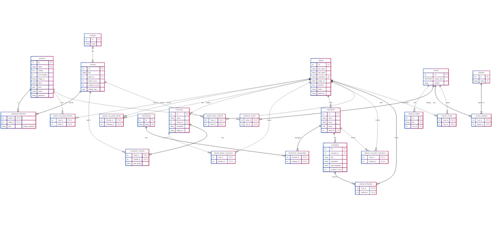

# Design Document

**By Esraa Abduallah**

**Video Overview:** [Watch here](https://youtu.be/DaRYJJ6w7hI?si=KwpZwDRc__Wfv57z)

---

## Scope

This database is designed to store and manage data related to users, artists, and the organization of their artwork and listening behavior. The goal is to enable seamless interaction with data, and to gather valuable insights and statistics that can benefit artists, music companies, and producers.

The design simulates how Spotify might structure data in a SQL database. It ensures:

* **Consistency**: Among data and operations.
* **Security**: Prevent unauthorized data access.
* **Optimization**: For faster data retrieval and better user experience.

### In-Scope Entities

* Artists
* Albums
* Tracks
* Users
* Playlists
* Categories
* Podcasts
* Episodes
* Tours
* Ticket Links
* Genres

### Out-of-Scope Entities

* Concert history of an artist
* Tracks played by users
* Music production companies
* Advertisements

---

## Functional Requirements

Users should be able to:

* Connect to the database using the SQLite CLI or through SQLite libraries in languages such as Python and Java.
* Insert data into the database.
* Select all playlists from a view.
* Load the latest podcast episodes.
* Load newly released songs.
* Retrieve an artist's most popular tracks.
* Retrieve an artist's latest albums.
* Retrieve user-saved playlists.
* Retrieve artists followed by a user.
* Retrieve songs from a playlist.
* Retrieve songs from an album.
* Get album statistics.
* Get podcast episodes and info.
* Retrieve user-saved episodes.
* Retrieve artist tours and tour details.
* Retrieve songs liked by a user.
* Retrieve tours the user is interested in.
* Update user profile picture and email.
* Update playlist details.
* Subscribe a user to a premium account.
* Remove a track from an album.
* Delete a playlist or remove it from saved playlists.
* Unfollow an artist or another user.
* Remove episodes from user collections.
* Unlike songs.
* Remove a tour from user events.

### Out-of-Scope Functionality

* Managing data about music production companies, their owners, and their tracks.
* Managing data about theatres and venues.
* Tracking user listening patterns.
* Collecting play statistics.
* Storing payment or credit card information.

---

## Representation

### Entities

#### `artists`

* `id`: Integer (Primary key)
* `name`: Text (Required, Unique)
* `email`: Text (Required, Unique)
* `password`: Text (Required)
* `verified`: Integer (0 or 1, Defaults to 0)
* `num_listeners`: Integer (>= 0, Defaults to 0)
* `image_url`: Text (Defaults to placeholder [https://placehold.co/600x400/png](https://placehold.co/600x400/png))
* `about`: Text
* `start_year`: Integer (>= 1500)

#### `albums`

* `id`: Integer (Primary key)
* `name`: Text (Required)

#### `tracks`

* `id`: Integer (Primary key)
* `title`: Text (Required)
* `listens_count`: Integer (>= 0, Defaults to 0)
* `duration_in_mins`: Integer (>= 1)
* `release_year`: Integer (>= 1500)

#### `users`

* `id`: Integer (Primary key)
* `first_name`: Text (Required)
* `last_name`: Text (Required)
* `username`: Text (Required, Unique)
* `email`: Text (Required, Unique)
* `password`: Text (Required)
* `image_url`: Text (Defaults to [https://placehold.co/600x400/png](https://placehold.co/600x400/png))
* `premium`: Integer (0 = non-premium, 1 = premium, Defaults to 0)

#### `playlists`

* `id`: Integer (Primary key)
* `name`: Text (Required)
* `description`: Text
* `image_url`: Text (Defaults to placeholder)

#### `categories`

* `id`: Integer (Primary key)
* `name`: Text (Required, Unique)

#### `podcasts`

* `id`: Integer (Primary key)
* `name`: Text (Required)
* `about`: Text
* `rating`: Real (Range: 0 to 5)

#### `episodes`

* `id`: Integer (Primary key)
* `title`: Text (Required)
* `description`: Text
* `date_streamed`: Numeric (Stored as numeric in SQLite, Required)
* `duration_in_mins`: Integer (>= 1, Required)

#### `tours`

* `id`: Integer (Primary key)
* `concert_time`: Numeric (Date/time stored as numeric in SQLite, Required)
* `location`: Text (Required)

#### `tickets_links`

* `id`: Integer (Primary key)
* `link`: Text (Required, Unique)

#### `genres`

* `id`: Integer (Primary key)
* `name`: Text (Required, Unique)

### Relationships

#### ER Diagram

#### Relationship Summary

* `albums` → `tracks`: One-to-many
* `tracks` ↔ `artists`: Many-to-many
* `users` ↔ `artists`: Many-to-many
* `users` ↔ `users`: Many-to-many
* `users` → `playlists`: One-to-many (creator)
* `users` ↔ `playlists`: Many-to-many (saved)
* `tracks` ↔ `playlists`: Many-to-many
* `users` → `podcasts`: One-to-many (owner)
* `podcasts` ↔ `categories`: Many-to-many
* `podcasts` → `episodes`: One-to-many
* `users` ↔ `podcasts`: Many-to-many (followers)
* `users` ↔ `tracks`: Many-to-many
* `users` ↔ `episodes`: Many-to-many
* `tours` → `tickets_links`: One-to-many
* `artists` ↔ `tours`: Many-to-many
* `tours` ↔ `genres`: Many-to-many
* `users` ↔ `tours`: Many-to-many

---

## Optimizations

### Indexes

Indexes were added to frequently queried columns to optimize performance:

* `artist_name`: `artists.name`
* `artist_login`: `artists.email`, `artists.password`
* `album_name`: `albums.name`
* `track_title`: `tracks.title`
* `track_album`: `tracks.album_id`
* `track_release_year`: `tracks.release_year`
* `track_artist`: `tracks_by_artists.artist_id`
* `user_login`: `users.email`, `users.password`
* `user_following_artists`: `users_follows_artists.user_id`
* `artist_followers`: `users_follows_artists.artist_id`
* `user_following_users`: `users_follows_users.follower_id`
* `user_followers`: `users_follows_users.following_id`
* `playlist_name`: `playlists.name`
* `owner_playlists`: `playlists.creator_id`
* `user_saved_playlists`: `users_save_playlists.user_id`
* `playlist_saves`: `users_save_playlists.playlist_id`
* `playlist_tracks`: `playlists_tracks.playlist_id`
* `podcast_name`: `podcasts.name`
* `owner_podcasts`: `podcasts.owner_id`
* `category_podcasts`: `podcasts_categories.category_id`
* `podcast_categories`: `podcasts_categories.podcast_id`
* `podcast_episodes`: `episodes.podcast_id`
* `episode_title`: `episodes.title`
* `user_following_podcasts`: `users_follows_podcasts.user_id`
* `podcast_followers`: `users_follows_podcasts.podcast_id`
* `user_liked_tracks`: `users_likes_tracks.user_id`
* `user_saved_episodes`: `users_episodes.user_id`
* `tour_tickets`: `tickets_links.tour_id`
* `artist_tours`: `artists_tours.artists_id`
* `tour_artists`: `artists_tours.tours_id`
* `tour_date`: `tours.concert_time`
* `location_tours`: `tours.location`
* `tour_genres`: `tours_genres.tour_id`
* `genre_tours`: `tours_genres.genre_id`
* `user_events`: `users_tours.user_id`

### Views

Views were created to display general information that can be accessed by all users and aggregated from multiple tables:

* **Homepage playlists**: Playlist name, description, image URL, and creator username
* **Latest podcast episodes**: Episode title, podcast name, description, stream date, and duration
* **New releases**: Track title and artist name

---

## Limitations

Current limitations include:

* Representing the music production process
* Connecting theatres and venues to artists and genres
* Tracking individual user listening behavior
